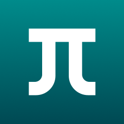

# Celeritas

Celeritas is a free and open-source performance & shaders mod for Minecraft clients. It is a fork of Embeddium (which itself
was based on the last FOSS-licensed version of Sodium) and Oculus 1.7.

I maintain this mod for personal use & experimentation and make the source code available for other projects and
developers who may be interested. There is also no guarantee of active maintenance, including bugfixes
or ports to any newer Minecraft versions. That said, the code remains
LGPL-3.0, so other projects under a compatible license (including Embeddium) should feel free to incorporate bugfixes
and features they find useful. That said, expect minimal support, and many possible bugs due to limited testing.

**Important note:** There are currently no official Celeritas binary releases. If you download a precompiled
Celeritas .jar file from any 3rd party source, we cannot provide any support for such files, and you do so at your own
risk. As of writing, the only official distribution of Celeritas available is the original source code
at https://git.taumc.org/embeddedt/celeritas, 

## Project layout

Celeritas uses the [Stonecutter](https://codeberg.org/stonecutter/stonecutter) toolchain to reduce the effort required
to support individual Minecraft versions. Additionally, as much core rendering code as possible is fully abstracted
from Minecraft within a `:common` project. The common module is published on
[Maven](https://maven.taumc.org/#/releases/org/embeddedt/celeritas/celeritas-common), to allow downstream projects to
consume it without rebuilding the entire project from source. However, the production mod jars are not available on Maven.

## How to build

**`celeritas_target_versions` must be set when building locally, as no projects are configured by default.**
You may want to set it in your user properties file (e.g. `~/.gradle/gradle.properties`) to avoid specifying
it in every command-line Gradle invocation or modifying the checked-in `gradle.properties`.

The fastest way to build for exactly one version target is to run `./gradlew -Pceleritas_target_versions=<version> packageJar`.
The resulting jar file will be available
in `build/libs/<celeritas version>`.

Note: the `celeritas_target_versions` property accepts a standard Stonecutter predicate, so you can also use syntax like
`./gradlew -Pceleritas_target_versions="<1.8.9"`.

Alternatively, `celeritas_target_versions_pattern` accepts a Java regex, e.g.
`./gradlew -Pceleritas_target_versions_pattern=.* packageJar` to build every Minecraft version at once.

## How to use

Celeritas generally requires a "modernized" environment on older Minecraft versions, and will not run out-of-the-box
with a default modded Minecraft instance. Newer Minecraft versions ship with the necessary dependencies and will not
require any custom setup.

* Forge 1.12.2 is supported out of the box on Java 8 + LWJGL 2.
* Older versions of Minecraft require lwjgl3ify (or an equivalent) & Java 21. (This requirement will begin being relaxed in the near future.)
* For modern (1.13+) versions, the final mod jar should run as-is in a standard instance for that version (e.g. Java 17
or 21 are not required, unless the underlying Minecraft version itself requires them).

## License

Celeritas is licensed under the Lesser GNU General Public License version 3, as it only uses code from Iris 1.7,
Sodium 0.5.11-, and other FOSS projects.

Portions of the option screen code are based on Reese's Sodium Options by FlashyReese, and are used under the terms of
the [MIT license](https://opensource.org/license/mit), located in `src/main/resources/licenses/rso.txt`.

This project does not include and has no plans to include any code from Sodium 0.6+ or 0.5.12+, as these versions of
Sodium are not available under a free and open-source license.
Please reach out to @embeddedt on Discord if you have concerns regarding the license of any code in this project.

## Credits

* The CaffeineMC team, for developing Sodium 0.5.11 & older, and making it open source
* Asek3, for developing Rubidium, the original port of Sodium 0.5 to Forge
* CelestialAbyss, for developing the Embeddium logo (which is reused here aside from recoloring), and input-Here for some very good visual touchups
* Ven ([@basdxz](https://github.com/basdxz)), for help with translucency sorting, suggesting the general approach for async occlusion culling, and other suggestions during development
* XFactHD, Pepper, and anyone else I've forgotten to mention, for providing valuable code insights

YourKit supports open source projects with innovative and intelligent tools
for monitoring and profiling Java and .NET applications.
YourKit is the creator of <a href="https://www.yourkit.com/java/profiler/">YourKit Java Profiler</a>,
<a href="https://www.yourkit.com/.net/profiler/">YourKit .NET Profiler</a>,
and <a href="https://www.yourkit.com/youmonitor/">YourKit YouMonitor</a>.

Special thanks to YourKit for providing a free license for my various open-source Minecraft projects.